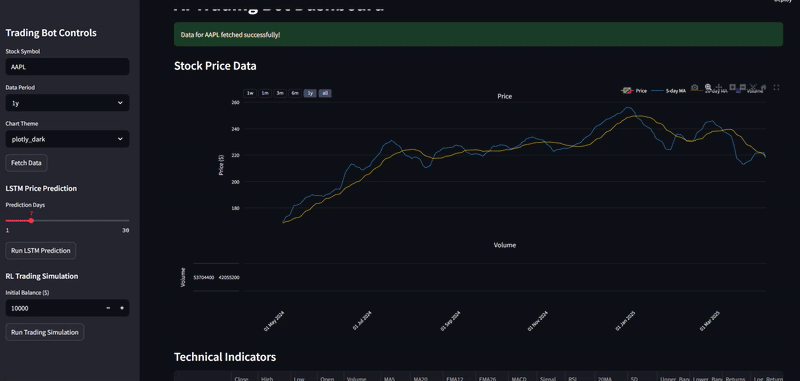

# AI Trading Bot

An AI-powered trading bot that combines machine learning and reinforcement learning to predict stock prices and automate trading decisions.

## Video example : 



## Try it at : https://ai-trading-bot-ciynoabx9pjekyumdorrkr.streamlit.app/

## Features

- **Data Fetching**: Retrieves historical stock data using yfinance
- **LSTM Prediction**: Implements a deep learning LSTM model to predict future stock prices
- **Custom Gymnasium Trading Environment**: Creates a trading simulation environment with:
  - Action space: Buy, Hold, Sell
  - Reward function: Combines Sharpe ratio and profit incentives
- **Reinforcement Learning Agent**: Trains a PPO agent using Stable-Baselines3
- **Interactive Dashboard**: Streamlit dashboard showing real-time predictions, portfolio simulation, and trade decision explanations

## Installation

1. Clone the repository:
```bash
git clone https://github.com/Psantaniello24/AI-TRADING-BOT.git
```

2. Create and activate a virtual environment:
```bash
python -m venv venv
# On Windows
venv\Scripts\activate
# On macOS/Linux
source venv/bin/activate
```

3. Install the required packages:
```bash
pip install -r requirements.txt
```

## Usage

### Dashboard (Default)

Run the Streamlit dashboard:
```bash
python main.py
# or directly with streamlit
streamlit run dashboard.py
```

### Train LSTM Model

Train the LSTM model for price prediction:
```bash
python main.py --mode train_lstm --ticker AAPL --period 2y
```

### Train RL Agent

Train the reinforcement learning agent:
```bash
python main.py --mode train_rl --ticker AAPL --period 2y --balance 10000 --timesteps 10000
```

### Backtest Strategy

Backtest the trading strategy:
```bash
python main.py --mode backtest --ticker AAPL --period 2y --balance 10000
```

## Project Structure

```
.
├── README.md
├── requirements.txt
├── main.py                 # Main script to run the application
├── data_fetcher.py         # Module for fetching and processing stock data
├── lstm_model.py           # LSTM model for price prediction
├── trading_env.py          # Custom Gymnasium trading environment
├── rl_agent.py             # Reinforcement learning agent
├── dashboard.py            # Streamlit dashboard
└── .streamlit/             # Streamlit configuration
    └── config.toml         # Streamlit theme and settings
```

## Components

### Data Fetcher

The `DataFetcher` class is responsible for:
- Fetching historical stock data using yfinance
- Creating technical indicators (Moving Averages, MACD, RSI, etc.)
- Preprocessing data for the LSTM model

### LSTM Model

The `StockPredictor` class implements:
- A deep learning model with multiple LSTM layers
- Training functionality with customizable parameters
- Price prediction capabilities

### Trading Environment

The `TradingEnvironment` class creates:
- A Gymnasium-compatible trading simulation environment
- Action space: Buy, Hold, Sell
- Observation space: Technical indicators and price data
- Reward function: Combines Sharpe ratio and profit incentives

### RL Agent

The `TradingRLAgent` class implements:
- A PPO agent from Stable-Baselines3
- Training, testing, and backtest capabilities
- Trade decision explanations

### Dashboard

The Streamlit dashboard provides:
- Interactive stock data visualization
- LSTM-based price predictions
- Portfolio simulation
- Trade history and decision explanations

## Disclaimer

This trading bot is for educational purposes only. The predictions and trading signals should not be used for actual trading without extensive backtesting and risk management. The author is not responsible for any financial losses incurred from using this software.

## License

This project is licensed under the MIT License - see the LICENSE file for details. 
